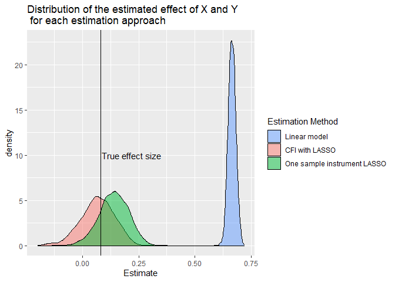
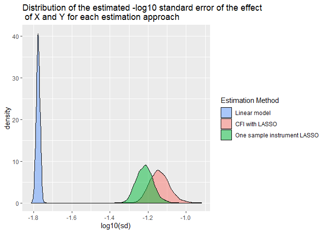
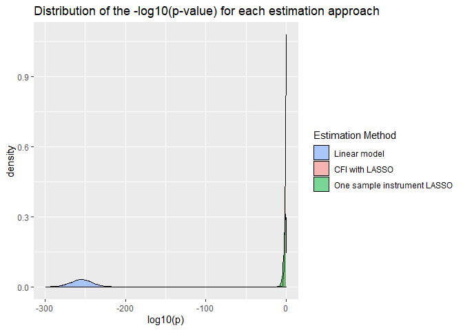

Cross-fitted instrument
================
William R.P. Denault
26/02/2021

## Cross-fitted instrument and Cross-fitting for Mendelian Randomization

Here we present basic scripts to obtain a cross-fitted instrument. For
the sake of simplicity, we don’t partition the data at random. A
complete CFMR pipeline with random splits is provided in the folder
CFMR\_pipeline\_code.

### A basic example

Here we define the parameters of our analysis

``` r
#number of individuals
n <- 5000
#Number of selected SNPs
p <- 100
#Number of SNPs affecting the exposure among the p selected
np_act <-5
sub_split <- 5#10 #number of split
```

Below we simulate the data, where G contains the selected SNPs (p) and
the (np\_act) first columns contain the actual causal SNPs. X and Y are
sampled with correlated noise (0.7) and H is the hidden confounded

``` r
set.seed(3)
#Y and X are sample with some correlated noise
noise <-rmvnorm(n, mean = rep(0, 2), sigma = matrix(nrow = 2, byrow = TRUE, c(1,0.7,0.7,1) ) )                    
#Genotype data, each of the SNP are sample at Hardy-Weinberg equilibrium for a MAF of 30%
  G <- matrix(sample(c(0,1,2), size= (n*p), prob = c(0.7^2, 2*0.7*0.3, 0.3^2), replace = TRUE),nrow= n)          
#Hidden confounding, increase sd to increase confounding
H <- rnorm(n, sd=1)
 
#ZPI is the part of X explained by the SNPs
ZPI <- 0.5*apply( G[, (1:np_act)],1, mean )
 
#X is compound of ZPI, H hidden confounding, and a noise that correlates with the noise of Y
X <- ZPI+H+ noise[,2]
#Y the exposure also affected by H
Y <- X+H+noise[,1] #Effect of X on Y is 1

cor(H,Y) #relatively large confouding
```

    ## [1] 0.7285258

### Cross-fitting function

Below the function used to obtain a cross-fitted instrument

``` r
#function to perform the cross fitting
build_IV_sub_sample <- function(i) #i in 0:(sub_split-1)
{
  indx <- (1+i*(n/sub_split)):((i+1)*(n/sub_split))# here the splits are not random
  Gtemp <- G[-indx,]
  Xtemp <- X[-indx]
  lasso <-  cv.glmnet(x=Gtemp, y=Xtemp,alpha=1)
  return(predict(lasso, G[indx,], s = "lambda.min")
  )
}
```

Here we estimate the effect of X on Y using three approaches, a naive
linear model, a one-sample instrument based on LASSO, and a cross-fitted
instrument based on LASSO.

``` r
###Standard linear model
res0 <- lm(Y~X)

#Identification and estimation of the insturement within the sample
lasso <-  cv.glmnet(x=G,y=X,alpha=1)

IV <-  predict(lasso,G,s = "lambda.min")
res1 <- ivreg(Y~X|IV)

# CFI estimation
res  <- lapply(0:(sub_split-1), build_IV_sub_sample)#performing cross-fitting
CFI <- do.call(c,res)
#cross fitted IV, CFMR2
res2 <- ivreg(Y~X|CFI)

summary(res0)$coef[2,] #Linear model, obviously confouded effect, true effect is 1
```

    ##     Estimate   Std. Error      t value     Pr(>|t|) 
    ## 1.833923e+00 7.511863e-03 2.441369e+02 0.000000e+00

``` r
summary(res1)$coef[2,] #One-sample LASSO, biased toward the confounded effect
```

    ##     Estimate   Std. Error      t value     Pr(>|t|) 
    ## 1.304540e+00 6.780506e-02 1.923957e+01 1.230060e-79

``` r
summary(res2)$coef[2,] #CFI-LASSO, at worse bias toward the null
```

    ##     Estimate   Std. Error      t value     Pr(>|t|) 
    ## 1.165090e+00 1.058469e-01 1.100731e+01 7.345632e-28

### Some larger simulation

Here we perform 2000 estimations of the effect of X on Y (parameter
n=1000, p=100, np\_act=5,beta=0.08,h2=0.1) using CFI, One sample
instrument LASSO estimate on, and a standard linear model. The function
used for the simulations can be found at the end.

``` r
res <- list( )
for ( i in 1:2000)
{
  res[[i]]  <- simu_cross_fit_IV_est (n=1000, p=100, np_act=5,beta=0.08,h2=0.1)
}

df0 <- data.frame(do.call( rbind, res))

colnames(df0)[2] <- "sd"
colnames(df0)[4] <- "p"
colnames(df0)[5] <- "Est_type"
df0$Est_type <- as.factor(df0$Est_type)
df0$Estimate <- as.numeric(as.character(df0$Estimate))
df0$sd       <- as.numeric(as.character(df0$sd))
df0$t.value  <- as.numeric(as.character(df0$t.value))
df0$p        <- as.numeric(as.character(df0$p))
```

<!-- -->

Clearly, LM and IV\_Lasso are overconfident. In the plot below, we see
that the linear model and On sample instrument LASSO have smaller
standard errors than CFI with LASSO, which implies overconfidence in the
significance of the estimated
effect.

<!-- --><!-- -->

## Simulation function

``` r
#n integer sample size of the analysis
#p number of selected SNP
#np_act number of SNPs actually modifying the exposure among the p selected SNP.
#h2 exposure variance explained by the np_act SNPs
#beta effect size of the exposure on the outcome

simu_cross_fit_IV_est <- function(n,p,np_act, h2, beta )
{
  if( missing(h2))
  {
    h2 <- 0.2
  }
  
  if( missing(beta))
  {
    beta <- 1
  }
  if(np_act >p)
  {
    print( "np_act should be smaller than p")
    break
  }
  n <- n
  #Number of selected SNPs
  p <- p
  #Number of SNPs affecting the exposure
  np_act <- np_act
  #Genotype data
  G <- matrix(sample(c(0,1,2),
                     size= (n*p),
                     prob = c(0.7^2, 2*0.7*0.3, 0.3^2),
                     replace = TRUE),
              nrow= n)
  
  #Y and X are sample with some correlated noise
  noise <-rmvnorm(n, 
                  mean = rep(0, 2), 
                  sigma = matrix(nrow = 2,
                                 byrow = TRUE,
                                 c(1,0.7,0.7,1)
                  )
  )

  
  
  #Hidden confounding
  H <- rnorm(n)
  #correlated noise 
  noise <-rmvnorm(n, 
                  mean = rep(0, 2), 
                  sigma = matrix(nrow = 2,
                                 byrow = TRUE,
                                 c(1,0.2,0.2,1)
                  )
  )
  
  
  
  V <- noise[,2]
  
  U <- noise[,1]
  
  
  #rescaling for insuring h2 = h2 on average
  tt <- apply( G[, (1:np_act)],1,sum)#genotype effect
  if( h2==0)
  {
    resc <- 0
  }else{resc <- ((var(H)+var(V))*(h2/(1-h2)))/var(tt)
  
  
  }
  
  ZPI <- sqrt(resc)*tt 
  
  
  #X is compound of ZPI , H hidden confounding, and a noise that correlates with the noise of Y
  
  X <- ZPI + H + V
  
  #Y the exposure also affected by H
  
  Y <- beta*X + H + U
  
  build_IV_sub_sample <- function(i) 
  {
    indx <- (1+i*(n/sub_split)):((i+1)*(n/sub_split))
    
    
    Gtemp <- G[-indx,]
    Xtemp <- X[-indx]
    
    lasso <-  cv.glmnet(x=Gtemp, y=Xtemp,alpha=1)
    return(predict(lasso, G[indx,], s = "lambda.min"))
  }
  
  
  
  #LM estimate
  res1 <- summary(lm(Y~X))$coef[2,]
  #Cross fitting LASSO
  res  <- lapply(0:(sub_split-1), build_IV_sub_sample)
  IV   <- do.call(c,res)
  res2 <- summary(ivreg(Y~X|IV))$coef[2,]
  
  #One sample lasso IV
  lasso <-  cv.glmnet(x=G, y=X,alpha=1)
  IV <- predict(lasso, G, s = "lambda.min")
  res3 <- summary(ivreg(Y~X|IV))$coef[2,]
  
  
  out  <- data.frame(rbind(res1,res2,res3))
  out$type <- c("LM","CFI_LASSO","IV_LASSO")
 
  return(out)
}
```
